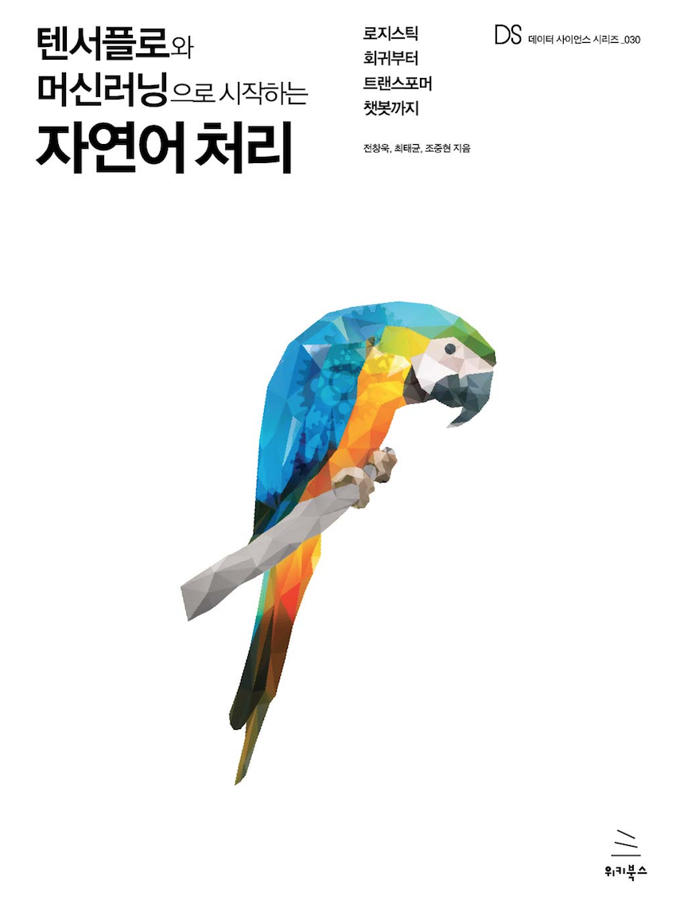

# NLPBOOK

텐서플로우와 머신러닝으로 시작하는 자연어처리(로지스틱회귀회귀부터 트렌스포머 챗봇까지)  
<p align="center">
   
</p>

## 소개 (Introduction)

책에 수록된 자연어 처리 예제들을 모아놓은 레파지토리를 참고하여 공부한 내용입니다.

하단에 해당 자연어 처리를 공부하면서 참고한점과 기본적인 흐름을 작성해놨습니다.

해당 책이 tensorflow==1.10 을 기준으로 작성되어 실제 공부할 떄는 tensorflow 2.x 버젼을 기준으로 공부 진행하였으며,  
작성된 코드에 대해서는 "s_xx" 인 글로 분류 하였습니다. 


## 필요한 라이브러리들 (Reuquirements)
1. Python3
2. Tensorflow
4. numpy
5. pandas
6. matplot


## 설치방법 (Environments)
```
pip install -r requirements.txt
```

만약 설치가 정상적으로 진행되지 않으신다면 python 3.6을 설치하여 진행해주시기 바랍니다.
```
conda install python=3.6
```
#### GPU 사용 시 CUDA 설치 관련

- GPU를 사용하는 경우에는 텐서플로우와 호환이 되는 CUDA Version을 맞춰 설치해야 합니다.
- 현재 본 프로젝트는 `tensorflow==1.10` 버전에서 실행이 가능하도록 구현 및 테스트를 하였습니다.
- `tensorflow-gpu==1.10` 의 경우 `CUDA 9.0`을 설치해주시기 바랍니다.

<!-- >> - `tensorflow-gpu>=1.13` 의 경우 `CUDA 10.0`을 설치해주시기 바랍니다. -->
<!-- >> - `tensorflow-gpu>=1.5,<=1.12` 의 경우 `CUDA 9.0`을 설치해주시기 바랍니다. -->
<!-- >> - `tensorflow-gpu>=1.0,<=1.4` 의 경우 `CUDA 8.0`을 설치해주시기 바랍니다. -->

## 목차 (Table of Contents)

**준비 단계** - 자연어 처리에 대한 배경과 개발에 대한 준비를 위한 챕터입니다.

1. [들어가며](./1.Intro)
2. [자연어 처리 개발 준비](./2.NLP_PREP)
3. [자연어 처리 개요](./3.NLP_INTRO)

**자연어 처리 기본** - 자연어 처리에 기본적인 모델에 대한 연습 챕터입니다.

4. [텍스트 분류](./4.TEXT_CLASSIFICATION)
5. [텍스트 유사도](./5.TEXT_SIM)

**자연어 처리 심화** - 챗봇 모델을 통해 보다 심화된 자연어 처리에 대한 연습 챕터입니다.

6. [챗봇 만들기](./6.CHATBOT)

**두번째 책 링크: https://github.com/NLP-kr/tensorflow-ml-nlp-tf2**


--- 

**자연어 처리를 위한 기본 로직(개인 생각)**
- 자연어 분석을 위해서는 최초 단어 확인
- 단어 불용어, 접두어 등 전처리
- 토큰화
- 차원에 늪에 빠지지 않게 단어 임베딩 (TF-IDF, Word2Vec, GloVe)
- 해당 임베딩 모델에 대하여 추가 모델 훈련 진행(Classifier, CNN(컨볼루션 신경망)

**이미지 처리와는 다르게 단어 임베딩 작업이 진행되어야 한다**
